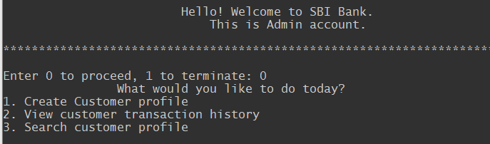
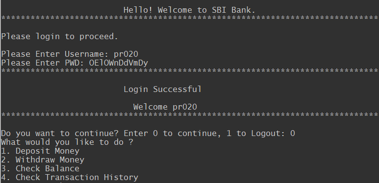

# ATM-machine-with-Python
A beginner’s project on writing Python codes that mimics an ATM machine function for — password creation, cash deposit, cash withdrawal, view customer transaction history, search customer profile and create customer profile.
It Consist Of Two Interface 
  1. Admin Who Create New Customer / View Customer Transcation History / Search Customer.
  2. Customer Who can Deposit Money / Withdraw Money / Check Balance / Check Transaction History.

### Admin Interface

 
 ### Customer Interface

